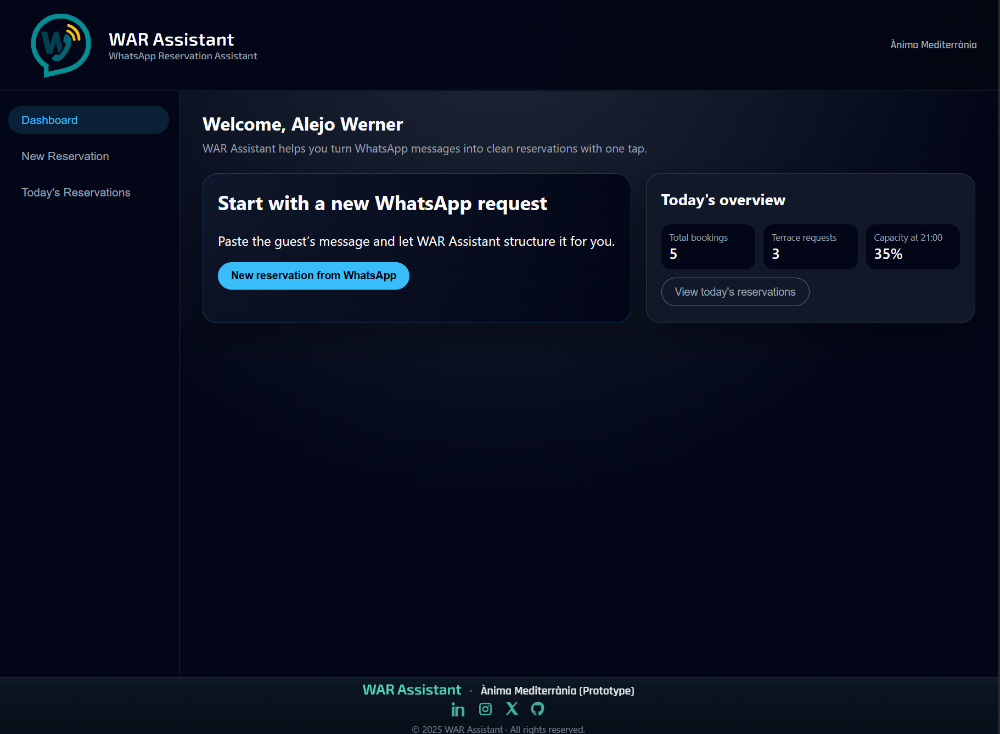

# WAR Assistant — Early Access Landing Page

A minimal landing page for validating interest in **WAR Assistant** (WhatsApp Reservation Assistant) by collecting early-access emails.

## What this is

This repository contains a static HTML/CSS/JS landing page used for an early-stage demand experiment:

- Explain the problem (WhatsApp booking chaos)
- Show the prototype dashboard
- Collect emails for early access (via Formspree)
- Validate interest before building the full SaaS

## Preview

## Run locally

You can open `index.html` directly in your browser, or use VS Code Live Server:

1. Open the folder in VS Code
2. Install the **Live Server** extension
3. Right-click `index.html` → **Open with Live Server**

## Live site (GitHub Pages)

Once deployed, the site will be available at:

👉 **https://ggonzalezdal.github.io/war-assistant-landing-page/**

## Tech stack

- HTML
- CSS
- Vanilla JavaScript

## Purpose

This landing page is part of a lean validation experiment for the WAR Assistant project,
developed in the context of the Entrepreneurship subject at UOC.

## License

MIT — see [LICENSE](LICENSE).
